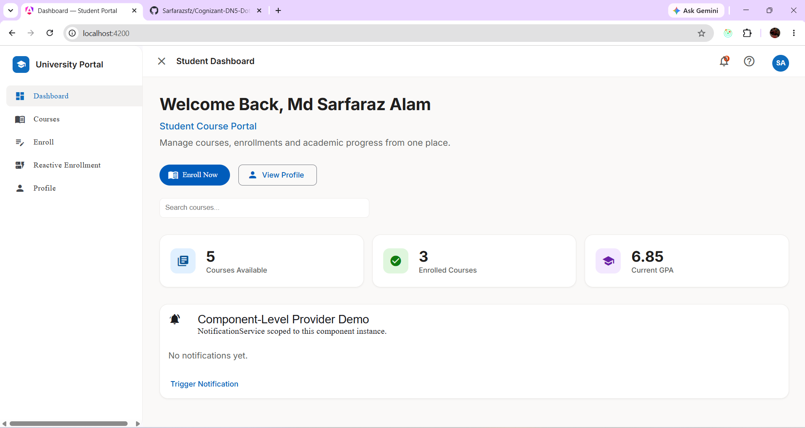
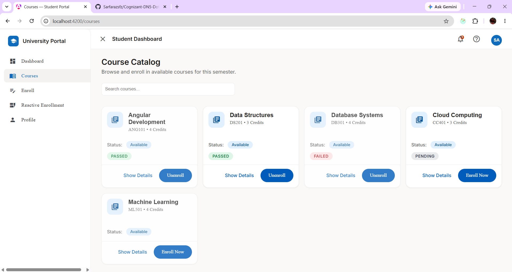
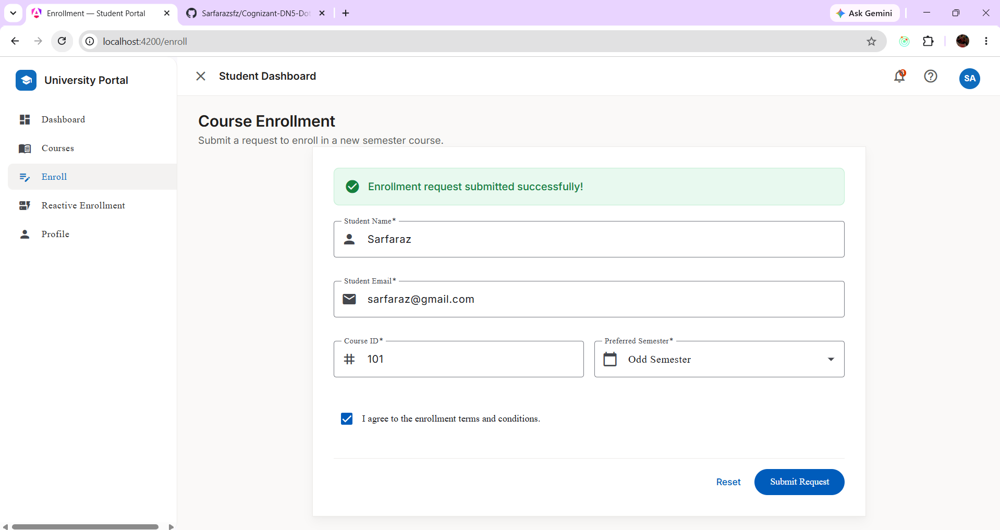
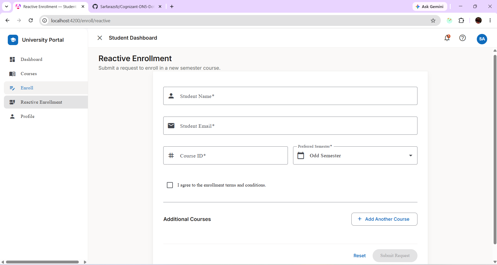
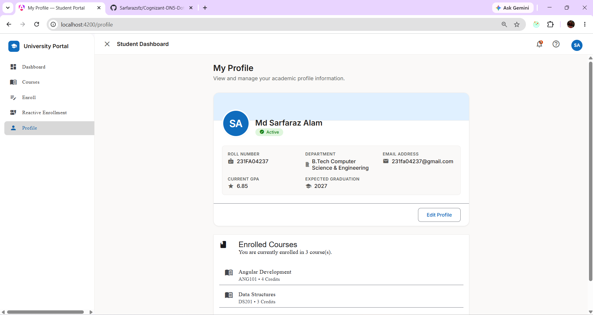
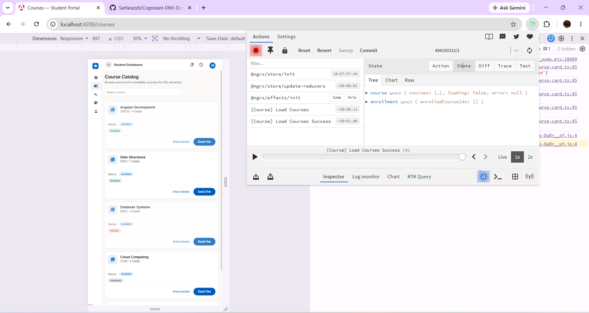
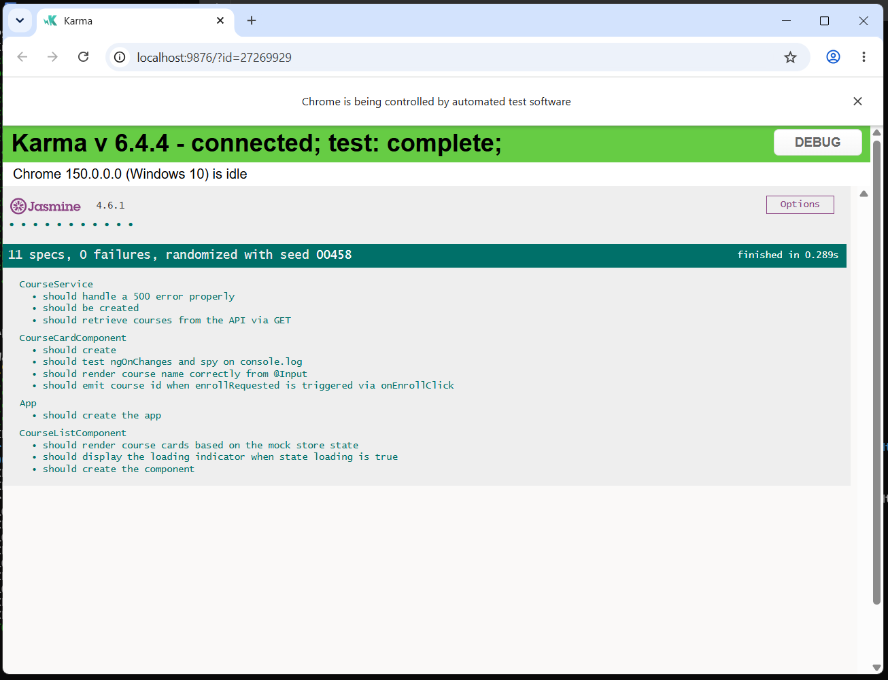
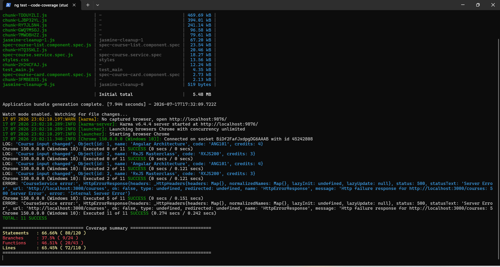
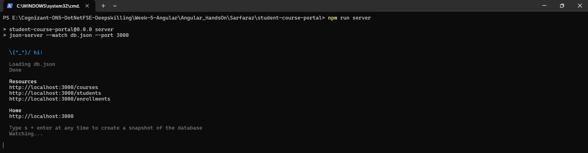
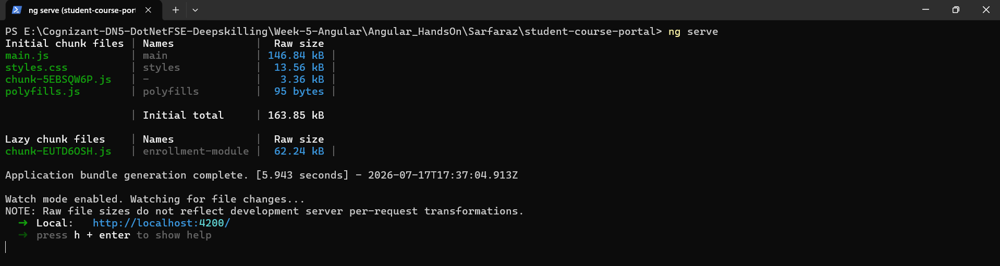

# Student Course Portal

Student Course Portal is an Angular-based web application developed as part of the Cognizant Digital Nurture 5.0 Angular Hands-On exercises. The project demonstrates Angular fundamentals and advanced concepts including routing, forms, HTTP communication, state management with NgRx, and unit testing.

## Live Demo

**Frontend (Vercel)**

https://cognizant-dn-5-dot-net-fse-deepskil.vercel.app/

**Backend API (Render)**

https://student-course-portal-api.onrender.com

---

## Project Objective

The objective of this project is to provide a student portal where users can browse available courses, enroll in programs, manage profile information, and demonstrate the Angular concepts covered throughout the Cognizant Digital Nurture 5.0 learning modules.

## Features

- Browse available courses
- Student enrollment
- Profile management
- Angular Routing
- Template-driven Forms
- Reactive Forms
- HTTP Client integration
- Route Guards
- HTTP Interceptors
- NgRx State Management
- Unit Testing using Jasmine & Karma
- Mock REST API using JSON Server

## Technologies Used

- Angular 20
- TypeScript
- RxJS
- NgRx
- Angular Router
- Angular Forms
- Angular Material
- JSON Server
- Jasmine
- Karma

## Angular Concepts Covered

- Components and Templates
- Data Binding
- Directives
- Pipes
- Template-Driven Forms
- Reactive Forms
- Services & Dependency Injection
- Routing & Navigation
- HTTP Client
- Route Guards
- HTTP Interceptors
- State Management using NgRx
- Unit Testing

## Application Screenshots

### Dashboard



### Course Catalog



### Enrollment Form



### Reactive Enrollment Form



### Student Profile



### NgRx Redux DevTools



### Unit Test Results



### Code Coverage Report



### JSON Server Running



### Angular Application Running



## Installation

Clone the repository

```bash
git clone https://github.com/Sarfarazsfz/Cognizant-DN5-DotNetFSE-Deepskilling.git
```

Go to the project directory

```bash
cd Week-5-Angular/Angular_HandsOn/Sarfaraz/student-course-portal
```

Install dependencies

```bash
npm install
```

## Run Locally

Start Angular application

```bash
ng serve
```

Open

```text
http://localhost:4200
```

Start JSON Server

```bash
npm run server
```

API Endpoint

```text
http://localhost:3000
```

## Run Unit Tests

```bash
ng test
```

Generate code coverage

```bash
ng test --code-coverage
```

## Project Structure

```text
student-course-portal
│
├── src/
├── public/
├── db.json
├── angular.json
├── package.json
├── package-lock.json
├── Submission-Screenshots/
└── README.md
```

## Author

**Md Sarfaraz Alam**

B.Tech Computer Science and Engineering

VFSTR University, Guntur

Cognizant Digital Nurture 5.0 – Angular Hands-On Project